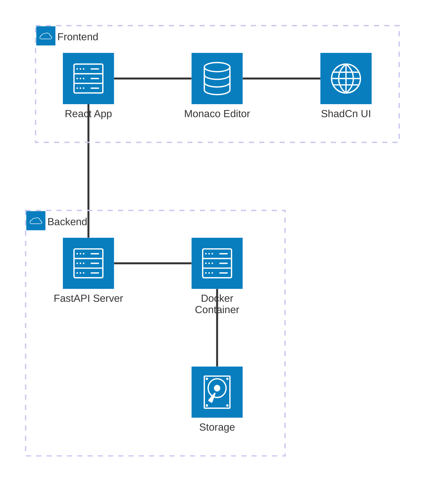
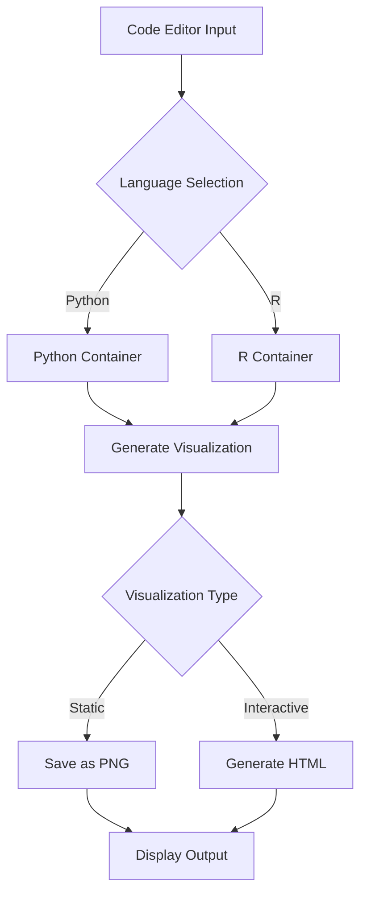

# Script Visualizer

A modern web application that allows users to generate data visualizations from Python and R scripts. This project emphasizes security, performance, and user experience by executing code in isolated containers and providing a rich development environment. The application fetches the latest code and updates via MCP servers to ensure consistency and freshness across environments.

## Tech Stack

### Frontend
- **React with Vite**: For lightning-fast development and optimal production builds
- **TypeScript**: For type safety and better developer experience
- **Monaco Editor**: VS Code-like script editing experience
- **ShadCn UI**: Modern, accessible UI components
- **Tailwind CSS**: Utility-first styling

### Backend
- **FastAPI**: High-performance Python web framework
- **Docker**: For secure script execution in isolated containers
- **Python Libraries**: matplotlib, plotly
- **R Libraries**: ggplot2

## Key Features

1. **Secure Code Execution**:
   - Scripts run in isolated Docker containers
   - Resource limits (CPU, memory, timeout)
   - Network access restrictions
   - Automated container cleanup after execution

2. **Rich Development Experience**:
   - Syntax highlighting for Python and R
   - Code examples for different visualization types
   - Real-time preview

3. **Multiple Visualization Types**:
   - Static plots (PNG output)
   - Interactive visualizations (HTML output)
   - 3D visualizations (via plotly)

4. **Modern UI/UX**:
   - Dark/light theme support
   - Resizable panels
   - Copy-to-clipboard functionality
   - Error handling with user-friendly messages

5. **MCP Integration**:
   - Connects to MCP servers for code updates
   - Ensures consistent visualization environments

## Development Challenges & Solutions

1. **Container Security**
   - **Challenge**: Ensuring secure execution of user-submitted code
   - **Solution**: Implemented strict Docker container policies with resource limits and network isolation

2. **Cross-Language Support**
   - **Challenge**: Supporting both Python and R visualizations consistently
   - **Solution**: Created standardized output handlers for both languages and unified the API interface

3. **Performance Optimization**
   - **Challenge**: Handling long-running visualization scripts
   - **Solution**: Implemented proper timeout mechanisms and resource monitoring

4. **State Management**
   - **Challenge**: Managing complex UI state with multiple visualization options
   - **Solution**: Utilized React's built-in state management with custom hooks for complex state logic

## Environment Configuration

### Backend (.env)
```
API_V1_STR=/api/v1
DOCKER_CONTAINER_TIMEOUT=300
DOCKER_MEMORY_LIMIT=512m
DOCKER_CPU_LIMIT=0.5
DOCKER_NETWORK_ACCESS=false
```

### Frontend (.env)
```
VITE_BACKEND_URL=http://localhost:8000
```

## Getting Started

1. **Clone the repository**
```bash
git clone https://github.com/Aamir-Hullur/script-visualizer.git
```

2. **Backend Setup**
```bash
cd backend
python -m venv venv
source venv/bin/activate  # or `venv\Scripts\activate` on Windows
pip install -r requirements.txt

# Build Docker images for Python and R visualization environments
cd docker
chmod +x build_images.sh
./build_images.sh
```

3. **Frontend Setup**
```bash
cd frontend
npm install
```

4. **Start Development Servers**
```bash
# Terminal 1 - Backend
cd backend
uvicorn app.main:app --reload

# Terminal 2 - Frontend
cd frontend
npm run dev
```

5. **Access the application**
```
Frontend: http://localhost:5173
Backend API: http://localhost:8000/docs
```

## Example Visualizations

### Python with Matplotlib (Static)
```python
import matplotlib.pyplot as plt
import numpy as np

# Generate data
x = np.linspace(0, 10, 100)
y = np.sin(x)

# Create visualization
plt.figure(figsize=(8, 6))
plt.plot(x, y, 'b-', linewidth=2)
plt.title('Sine Wave')
plt.xlabel('X axis')
plt.ylabel('Y axis')
plt.grid(True)
plt.savefig('/output/plot.png')  # Save to mounted output directory
```

### Python with Plotly (Interactive)
```python
import plotly.express as px
import pandas as pd

# Create sample data
data = {
    'Category': ['A', 'B', 'C', 'D'],
    'Values': [10, 40, 30, 20]
}
df = pd.DataFrame(data)

# Create interactive visualization
fig = px.bar(df, x='Category', y='Values', title='Interactive Bar Chart')
fig.write_html('/output/plot.html')  # Save as interactive HTML
```

### R with ggplot2 (Static)
```r
library(ggplot2)

# Create sample data
data <- data.frame(
  x = 1:10,
  y = 1:10
)

# Create visualization
p <- ggplot(data, aes(x, y)) +
  geom_point() +
  geom_smooth(method = "lm") +
  theme_minimal() +
  labs(title = "Linear Relationship")

# Save to output directory
ggsave("/output/plot.png", p)
```

## System Architecture



## Visualization Flow



## Future Implementations

1. Support for more programming languages
2. Additional visualization libraries
3. Collaborative features
4. User accounts and saved visualizations
5. Adding a download button
6. Custom dataset upload functionality